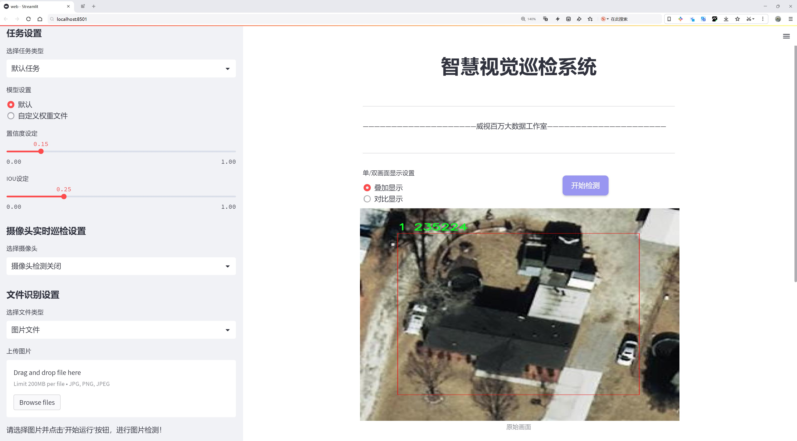

# 航拍房屋检测检测系统源码分享
 # [一条龙教学YOLOV8标注好的数据集一键训练_70+全套改进创新点发刊_Web前端展示]

### 1.研究背景与意义

项目参考[AAAI Association for the Advancement of Artificial Intelligence](https://gitee.com/qunmasj/projects)

项目来源[AACV Association for the Advancement of Computer Vision](https://kdocs.cn/l/cszuIiCKVNis)

研究背景与意义

随着无人机技术的迅猛发展，航拍技术在各个领域的应用日益广泛，尤其是在城市规划、房地产评估、环境监测等方面，航拍图像的获取为相关研究提供了丰富的数据支持。然而，航拍图像的复杂性和多样性使得从中提取有用信息的任务变得尤为困难。传统的图像处理方法在处理航拍图像时往往面临着高背景噪声、视角变化、光照不均等问题，这些因素都严重影响了目标检测的准确性和效率。因此，开发一种高效、准确的航拍房屋检测系统显得尤为重要。

在此背景下，YOLO（You Only Look Once）系列目标检测算法因其高效性和实时性，逐渐成为目标检测领域的研究热点。YOLOv8作为该系列的最新版本，结合了深度学习的最新进展，具有更高的检测精度和更快的处理速度。通过对YOLOv8进行改进，尤其是在网络结构、损失函数和数据增强等方面的优化，可以进一步提升其在航拍房屋检测中的表现。此外，针对特定的航拍场景，设计合适的数据集并进行精细化标注，是提升模型性能的关键。

本研究将基于一个包含2196张图像的特定数据集进行房屋检测，数据集中涵盖了两类目标，分别为“房屋”和“非房屋”类别。这一数据集的构建不仅为模型的训练提供了丰富的样本，也为后续的模型评估和应用提供了基础。通过对这些图像进行深度学习模型的训练，可以有效地提高房屋检测的准确性，进而推动航拍技术在城市建设、房地产市场分析等领域的应用。

研究的意义不仅在于提升航拍房屋检测的技术水平，更在于为相关行业提供决策支持。准确的房屋检测系统能够帮助城市规划者更好地理解城市空间结构，优化资源配置；同时，房地产开发商也可以通过该系统进行市场分析，制定合理的开发策略。此外，该系统的成功应用还可以为环境监测提供数据支持，助力可持续发展目标的实现。

综上所述，基于改进YOLOv8的航拍房屋检测系统的研究，不仅具有重要的学术价值，也具备广泛的实际应用前景。通过本研究的开展，期望能够推动航拍技术与深度学习的结合，为相关领域的研究与实践提供新的思路和方法。

### 2.图片演示





##### 注意：由于此博客编辑较早，上面“2.图片演示”和“3.视频演示”展示的系统图片或者视频可能为老版本，新版本在老版本的基础上升级如下：（实际效果以升级的新版本为准）

  （1）适配了YOLOV8的“目标检测”模型和“实例分割”模型，通过加载相应的权重（.pt）文件即可自适应加载模型。

  （2）支持“图片识别”、“视频识别”、“摄像头实时识别”三种识别模式。

  （3）支持“图片识别”、“视频识别”、“摄像头实时识别”三种识别结果保存导出，解决手动导出（容易卡顿出现爆内存）存在的问题，识别完自动保存结果并导出到tempDir中。

  （4）支持Web前端系统中的标题、背景图等自定义修改，后面提供修改教程。

  另外本项目提供训练的数据集和训练教程,暂不提供权重文件（best.pt）,需要您按照教程进行训练后实现图片演示和Web前端界面演示的效果。

### 3.视频演示

[3.1 视频演示](https://www.bilibili.com/video/BV1K1tUeyEjb/)

### 4.数据集信息展示

##### 4.1 本项目数据集详细数据（类别数＆类别名）

nc: 2
names: ['0', '1']


##### 4.2 本项目数据集信息介绍

数据集信息展示

在本研究中，我们采用了名为“nrumba”的数据集，以改进YOLOv8的航拍房屋检测系统。该数据集专门设计用于支持房屋检测任务，涵盖了多种航拍场景，旨在提高模型在实际应用中的准确性和鲁棒性。数据集的类别数量为2，分别标记为‘0’和‘1’，这些类别可以代表不同类型的房屋或建筑物特征，具体的类别定义可以根据项目需求进行扩展和细化。

“nrumba”数据集的构建过程注重多样性和代表性，确保其包含了丰富的航拍图像。这些图像来源于不同的地理位置和环境条件，涵盖了城市、乡村及其周边地区的多种建筑类型。通过这样的设计，数据集能够有效模拟真实世界中的各种检测场景，增强模型的泛化能力。此外，数据集中的图像经过精心标注，确保每个样本的准确性，为后续的训练和评估提供了可靠的基础。

在数据集的使用过程中，我们特别关注数据的预处理和增强技术，以提升模型的训练效果。针对航拍图像的特点，我们应用了一系列图像处理技术，包括图像缩放、旋转、翻转及亮度调整等。这些技术不仅增加了数据集的多样性，还有效减少了模型对特定图像特征的依赖，从而提高了其在不同场景下的适应能力。

此外，为了确保模型的训练过程高效且稳定，我们对“nrumba”数据集进行了严格的划分，分为训练集、验证集和测试集。这样的划分方式使得我们能够在训练过程中实时监控模型的性能，并通过验证集调整超参数，以达到最佳的训练效果。测试集则用于最终评估模型的性能，确保其在未见数据上的表现符合预期。

在实际应用中，航拍房屋检测系统的需求日益增长，尤其是在城市规划、房地产评估和灾后重建等领域。通过使用“nrumba”数据集，我们的目标是构建一个高效、准确的检测系统，能够在各种复杂环境中快速识别和定位房屋。这不仅能够提高工作效率，还能为相关行业提供更为精准的数据支持。

综上所述，“nrumba”数据集为改进YOLOv8的航拍房屋检测系统提供了坚实的基础。通过对数据集的深入分析和合理利用，我们期望能够推动房屋检测技术的发展，助力智能城市建设和可持续发展目标的实现。随着研究的深入，我们将不断探索数据集的潜力，挖掘更多应用场景，为未来的研究提供新的思路和方向。


### 5.全套项目环境部署视频教程（零基础手把手教学）

[5.1 环境部署教程链接（零基础手把手教学）](https://www.ixigua.com/7404473917358506534?logTag=c807d0cbc21c0ef59de5)


[5.2 安装Python虚拟环境创建和依赖库安装视频教程链接（零基础手把手教学）](https://www.ixigua.com/7404474678003106304?logTag=1f1041108cd1f708b01a)

### 6.手把手YOLOV8训练视频教程（零基础小白有手就能学会）

[6.1 手把手YOLOV8训练视频教程（零基础小白有手就能学会）](https://www.ixigua.com/7404477157818401292?logTag=d31a2dfd1983c9668658)

### 7.70+种全套YOLOV8创新点代码加载调参视频教程（一键加载写好的改进模型的配置文件）

[7.1 70+种全套YOLOV8创新点代码加载调参视频教程（一键加载写好的改进模型的配置文件）](https://www.ixigua.com/7404478314661806627?logTag=29066f8288e3f4eea3a4)

### 8.70+种全套YOLOV8创新点原理讲解（非科班也可以轻松写刊发刊，V10版本正在科研待更新）

由于篇幅限制，每个创新点的具体原理讲解就不一一展开，具体见下列网址中的创新点对应子项目的技术原理博客网址【Blog】：


[8.1 70+种全套YOLOV8创新点原理讲解链接](https://gitee.com/qunmasj/good)

### 9.系统功能展示（检测对象为举例，实际内容以本项目数据集为准）

图9.1.系统支持检测结果表格显示

  图9.2.系统支持置信度和IOU阈值手动调节

  图9.3.系统支持自定义加载权重文件best.pt(需要你通过步骤5中训练获得)

  图9.4.系统支持摄像头实时识别

  图9.5.系统支持图片识别

  图9.6.系统支持视频识别

  图9.7.系统支持识别结果文件自动保存

  图9.8.系统支持Excel导出检测结果数据


### 10.原始YOLOV8算法原理

原始YOLOv8算法原理

YOLOv8作为YOLO系列的最新版本，于2023年1月10日正式发布，标志着计算机视觉领域目标检测和实例分割技术的又一次重大飞跃。该模型不仅在精度和执行速度上超越了所有已知的竞争对手，而且在设计上融合了前几代YOLO模型的优点，如YOLOv5、YOLOv6和YOLOX，形成了一种更为高效和灵活的架构。YOLOv8的设计理念旨在提供一种简洁易用的解决方案，同时又不牺牲性能，确保在多种应用场景下的有效性。

YOLOv8的核心创新在于其全新的骨干网络结构、Anchor-Free检测头和改进的损失函数。这些创新使得YOLOv8能够在各种硬件平台上高效运行，从CPU到GPU均能保持良好的性能。具体而言，YOLOv8在卷积层的设计上进行了重要的调整，将第一个卷积层的卷积核大小从6x6减小至3x3，这一变化不仅减少了计算复杂度，还提高了特征提取的精度。此外，YOLOv8将所有的C3模块替换为C2f模块，这一新模块通过增加跳层连接和Split操作，显著增强了网络的表达能力，使得模型在保持轻量化的同时，能够获取更丰富的梯度信息。

在网络结构方面，YOLOv8的Backbone中C2f的block数进行了重新设计，从原有的3-6-9-3调整为3-6-6-3。这一调整不仅优化了模型的深度和宽度，还使得特征图的生成更加高效，进一步提升了模型的检测能力。YOLOv8的Head部分则是其最大的变化之一，采用了解耦合的结构，将分类和回归任务分开处理，并从传统的Anchor-Based方法转变为Anchor-Free的检测方式。这一转变不仅简化了模型的设计，还提高了目标检测的灵活性，尤其是在处理小目标和高分辨率图像时表现得尤为突出。

YOLOv8还在数据增强和损失计算方面进行了创新。在训练过程中，YOLOv8借鉴了YOLOv6中的动态Task-Aligned Assigner样本分配策略，优化了样本的选择与分配，使得模型在训练时能够更有效地学习到目标的特征。同时，在损失计算上，YOLOv8使用了BCELoss作为分类损失，DFLLoss和CIoULoss作为回归损失，这一组合有效地提升了模型在目标检测任务中的准确性和鲁棒性。

在应用场景方面，YOLOv8展现出了极大的灵活性和适应性。无论是在智能监控、自动驾驶还是人脸识别等领域，YOLOv8都能够提供高效的目标检测解决方案。其在COCOVal2017数据集上的表现，尤其是在mAP（平均精度均值）和训练速度上均优于YOLOv5，充分证明了其技术优势。通过对比实验，YOLOv8在精度上提高了43.23%，而帧率则提升了10.28倍，这使得其在实时目标检测任务中具有了更强的竞争力。

YOLOv8的设计理念不仅仅是追求高精度和高速度，更在于提供一种简洁易用的工具，使得研究人员和开发者能够更方便地应用于实际项目中。其模块化的设计使得用户可以根据具体需求进行灵活的调整和优化，极大地降低了使用门槛。同时，YOLOv8的开源特性也为广大的开发者社区提供了一个良好的平台，促进了技术的传播与应用。

综上所述，YOLOv8作为YOLO系列的最新版本，通过一系列的创新和优化，不仅在技术上实现了突破，更在实际应用中展现出了强大的生命力。它的发布不仅为目标检测领域带来了新的思路，也为未来的研究与应用提供了广阔的空间。随着YOLOv8的不断发展与完善，预计将在更多的领域中发挥重要作用，推动计算机视觉技术的进一步进步。


### 11.项目核心源码讲解（再也不用担心看不懂代码逻辑）

#### 11.1 ui.py

以下是对给定代码的核心部分进行提炼和详细注释的版本：

```python
import sys  # 导入sys模块，用于访问与Python解释器紧密相关的变量和函数
import subprocess  # 导入subprocess模块，用于创建新进程、连接到它们的输入/输出/错误管道，并获取返回码
from QtFusion.path import abs_path  # 从QtFusion.path模块导入abs_path函数，用于获取文件的绝对路径

def run_script(script_path):
    """
    使用当前 Python 环境运行指定的脚本。

    Args:
        script_path (str): 要运行的脚本路径

    Returns:
        None
    """
    # 获取当前 Python 解释器的路径
    python_path = sys.executable

    # 构建运行命令，使用streamlit模块运行指定的脚本
    command = f'"{python_path}" -m streamlit run "{script_path}"'

    # 执行命令
    result = subprocess.run(command, shell=True)  # 运行命令并等待其完成
    if result.returncode != 0:  # 检查返回码，非零表示出错
        print("脚本运行出错。")  # 输出错误信息

# 实例化并运行应用
if __name__ == "__main__":
    # 指定要运行的脚本路径，使用abs_path获取绝对路径
    script_path = abs_path("web.py")

    # 运行指定的脚本
    run_script(script_path)
```

### 代码核心部分分析：
1. **导入模块**：
   - `sys`：用于获取当前Python解释器的路径。
   - `subprocess`：用于执行外部命令。
   - `abs_path`：用于获取文件的绝对路径。

2. **`run_script`函数**：
   - 该函数接受一个脚本路径作为参数，并使用当前Python环境运行该脚本。
   - 通过`sys.executable`获取当前Python解释器的路径。
   - 构建一个命令字符串，使用`streamlit`模块运行指定的脚本。
   - 使用`subprocess.run`执行命令，并检查返回码以判断脚本是否成功运行。

3. **主程序入口**：
   - 当脚本作为主程序运行时，指定要运行的脚本路径，并调用`run_script`函数执行该脚本。

这个文件名为 `ui.py`，其主要功能是通过当前的 Python 环境来运行一个指定的脚本。代码的结构相对简单，主要由几个部分组成。

首先，文件导入了必要的模块，包括 `sys`、`os` 和 `subprocess`。`sys` 模块用于访问与 Python 解释器紧密相关的变量和函数，`os` 模块提供了与操作系统交互的功能，而 `subprocess` 模块则用于创建新进程、连接到它们的输入/输出/错误管道，并获取它们的返回码。

接下来，代码定义了一个名为 `run_script` 的函数，该函数接受一个参数 `script_path`，表示要运行的脚本的路径。在函数内部，首先获取当前 Python 解释器的路径，这通过 `sys.executable` 实现。然后，构建一个命令字符串，该命令使用 `streamlit` 来运行指定的脚本。`streamlit` 是一个用于构建数据应用的库，这里通过 `-m` 参数来运行模块。

构建完命令后，使用 `subprocess.run` 来执行这个命令。`shell=True` 参数允许在 shell 中执行命令。如果脚本运行的返回码不为零，表示运行过程中出现了错误，程序会打印出“脚本运行出错”的提示。

最后，代码通过 `if __name__ == "__main__":` 来判断当前模块是否是主程序。如果是，则指定要运行的脚本路径为 `web.py`，并调用 `run_script` 函数来执行这个脚本。`abs_path` 函数被用来获取 `web.py` 的绝对路径，确保脚本能够被正确找到并运行。

总体来说，这个 `ui.py` 文件的主要作用是作为一个启动器，方便用户通过当前的 Python 环境来运行一个名为 `web.py` 的脚本，特别是用于 Streamlit 应用的启动。

#### 11.2 code\ultralytics\hub\session.py

以下是代码中最核心的部分，并附上详细的中文注释：

```python
class HUBTrainingSession:
    """
    HUBTrainingSession类用于管理Ultralytics HUB YOLO模型的训练会话，包括模型初始化、心跳监测和检查点上传等功能。
    """

    def __init__(self, identifier):
        """
        初始化HUBTrainingSession，使用提供的模型标识符。

        参数:
            identifier (str): 用于初始化HUB训练会话的模型标识符，可以是URL字符串或特定格式的模型键。

        异常:
            ValueError: 如果提供的模型标识符无效。
            ConnectionError: 如果不支持使用全局API密钥连接。
            ModuleNotFoundError: 如果未安装hub-sdk包。
        """
        from hub_sdk import HUBClient

        # 设置API请求的速率限制
        self.rate_limits = {
            "metrics": 3.0,  # 上传指标的速率限制
            "ckpt": 900.0,   # 上传检查点的速率限制
            "heartbeat": 300.0,  # 心跳监测的速率限制
        }
        self.metrics_queue = {}  # 存储每个epoch的指标，直到上传
        self.timers = {}  # 存储定时器

        # 解析输入的标识符
        api_key, model_id, self.filename = self._parse_identifier(identifier)

        # 获取凭证
        active_key = api_key or SETTINGS.get("api_key")
        credentials = {"api_key": active_key} if active_key else None  # 设置凭证

        # 初始化HUB客户端
        self.client = HUBClient(credentials)

        if model_id:
            self.load_model(model_id)  # 加载现有模型
        else:
            self.model = self.client.model()  # 加载空模型

    def load_model(self, model_id):
        """从Ultralytics HUB加载现有模型。"""
        self.model = self.client.model(model_id)
        if not self.model.data:  # 如果模型不存在
            raise ValueError("❌ 指定的HUB模型不存在")

        # 设置模型的URL
        self.model_url = f"{HUB_WEB_ROOT}/models/{self.model.id}"

        self._set_train_args()  # 设置训练参数

        # 启动心跳监测
        self.model.start_heartbeat(self.rate_limits["heartbeat"])
        LOGGER.info(f"查看模型: {self.model_url} 🚀")

    def _parse_identifier(self, identifier):
        """
        解析给定的标识符，提取相关组件。

        参数:
            identifier (str): 要解析的标识符字符串。

        返回:
            (tuple): 包含API密钥、模型ID和文件名的元组。

        异常:
            HUBModelError: 如果标识符格式无法识别。
        """
        api_key, model_id, filename = None, None, None

        # 检查标识符是否为HUB URL
        if identifier.startswith(f"{HUB_WEB_ROOT}/models/"):
            model_id = identifier.split(f"{HUB_WEB_ROOT}/models/")[-1]
        else:
            parts = identifier.split("_")

            # 检查标识符格式
            if len(parts) == 2 and len(parts[0]) == 42 and len(parts[1]) == 20:
                api_key, model_id = parts
            elif len(parts) == 1 and len(parts[0]) == 20:
                model_id = parts[0]
            elif identifier.endswith(".pt") or identifier.endswith(".yaml"):
                filename = identifier
            else:
                raise HUBModelError("模型标识符格式不正确。")

        return api_key, model_id, filename

    def upload_metrics(self):
        """上传模型指标到Ultralytics HUB。"""
        return self.request_queue(self.model.upload_metrics, metrics=self.metrics_queue.copy(), thread=True)

    def upload_model(self, epoch: int, weights: str, is_best: bool = False, map: float = 0.0, final: bool = False) -> None:
        """
        上传模型检查点到Ultralytics HUB。

        参数:
            epoch (int): 当前训练的epoch。
            weights (str): 模型权重文件的路径。
            is_best (bool): 当前模型是否为最佳模型。
            map (float): 模型的平均精度。
            final (bool): 模型是否为训练后的最终模型。
        """
        if Path(weights).is_file():
            progress_total = Path(weights).stat().st_size if final else None  # 仅在最终模型时显示进度
            self.request_queue(
                self.model.upload_model,
                epoch=epoch,
                weights=weights,
                is_best=is_best,
                map=map,
                final=final,
                retry=10,
                timeout=3600,
                thread=not final,
                progress_total=progress_total,
            )
        else:
            LOGGER.warning(f"警告 ⚠️ 模型上传问题。缺少模型 {weights}。")
```

### 代码核心部分说明：
1. **HUBTrainingSession类**：负责管理与Ultralytics HUB的交互，包括模型的加载、训练参数的设置、指标和模型的上传等。
2. **初始化方法**：接收模型标识符，解析并初始化HUB客户端，加载模型。
3. **load_model方法**：根据模型ID加载模型，并启动心跳监测。
4. **_parse_identifier方法**：解析输入的标识符，支持多种格式，提取API密钥、模型ID和文件名。
5. **upload_metrics和upload_model方法**：负责将训练过程中生成的指标和模型权重上传到Ultralytics HUB。

这个程序文件是Ultralytics YOLO模型的一个训练会话管理类，名为`HUBTrainingSession`。它主要负责与Ultralytics HUB进行交互，处理模型的初始化、心跳监测和检查点上传等功能。

在文件开头，导入了一些必要的库和模块，包括`threading`、`time`、`requests`等。接着定义了一个名为`HUBTrainingSession`的类，该类的构造函数`__init__`接受一个模型标识符，并根据该标识符初始化会话。标识符可以是HUB URL、API密钥和模型ID的组合、单一模型ID或本地文件名。构造函数还会设置一些速率限制和定时器，并尝试加载指定的模型。

`load_model`方法用于从Ultralytics HUB加载现有模型，如果模型不存在，则抛出一个错误。该方法还会启动心跳监测，以便HUB能够监控代理的状态。

`create_model`方法用于根据提供的模型参数初始化一个新的训练会话，并创建模型的条目。如果模型创建失败，则会进行相应的处理。

`_parse_identifier`方法解析输入的标识符，提取出API密钥、模型ID和文件名。该方法支持多种格式的标识符，并在格式不正确时抛出错误。

`_set_train_args`方法用于初始化训练参数，并创建模型条目。如果模型已经训练过或可以恢复，则会相应地设置训练参数和模型文件。

`request_queue`方法用于处理HTTP请求，支持重试机制和超时设置。它可以在新的线程中运行请求，确保在请求失败时能够进行重试。

`_should_retry`方法根据HTTP状态码判断请求是否应该重试，而`_get_failure_message`方法则生成重试消息，帮助用户了解请求失败的原因。

`upload_metrics`和`upload_model`方法分别用于将模型的指标和检查点上传到Ultralytics HUB。`upload_model`方法会检查模型权重文件是否存在，并在上传时显示进度条。

最后，`_show_upload_progress`方法用于显示文件上传的进度条，提供用户友好的反馈。

总体来说，这个文件实现了与Ultralytics HUB的交互功能，支持模型的训练、监控和上传，方便用户进行YOLO模型的管理和使用。

#### 11.3 70+种YOLOv8算法改进源码大全和调试加载训练教程（非必要）\ultralytics\models\yolo\pose\__init__.py

以下是代码中最核心的部分，并附上详细的中文注释：

```python
# 导入所需的模块
from .predict import PosePredictor  # 导入姿态预测器
from .train import PoseTrainer      # 导入姿态训练器
from .val import PoseValidator       # 导入姿态验证器

# 定义模块的公开接口
__all__ = 'PoseTrainer', 'PoseValidator', 'PosePredictor'  # 指定可以被外部访问的类或函数
```

### 代码详细注释：

1. **导入模块**：
   - `from .predict import PosePredictor`：从当前包的 `predict` 模块中导入 `PosePredictor` 类，用于进行姿态预测。
   - `from .train import PoseTrainer`：从当前包的 `train` 模块中导入 `PoseTrainer` 类，用于训练姿态模型。
   - `from .val import PoseValidator`：从当前包的 `val` 模块中导入 `PoseValidator` 类，用于验证姿态模型的性能。

2. **定义公开接口**：
   - `__all__` 是一个特殊变量，用于定义当使用 `from module import *` 语句时，哪些类或函数可以被导入。在这里，指定了 `PoseTrainer`、`PoseValidator` 和 `PosePredictor` 三个类为公开接口，意味着这些类可以被外部模块访问和使用。

这个程序文件是一个Python模块的初始化文件，属于Ultralytics YOLO（You Only Look Once）系列的代码库，主要用于姿态估计（Pose Estimation）。文件名暗示了它是关于YOLOv8算法的一部分，包含了多种改进的源码和调试、加载、训练的教程。

在文件的开头，有一个注释行，表明该代码遵循AGPL-3.0许可证，这是一个开源许可证，允许用户自由使用、修改和分发代码，但要求任何衍生作品也必须在相同的许可证下发布。

接下来，文件通过相对导入的方式引入了三个类：`PosePredictor`、`PoseTrainer`和`PoseValidator`。这些类分别负责姿态预测、训练和验证的功能。具体来说，`PosePredictor`用于进行姿态的实时预测，`PoseTrainer`用于训练模型，而`PoseValidator`则用于验证模型的性能。

最后，`__all__`变量定义了该模块的公共接口，包含了可以被外部访问的类名。这意味着，当使用`from module import *`的方式导入该模块时，只会导入`PoseTrainer`、`PoseValidator`和`PosePredictor`这三个类。这种做法有助于控制模块的可见性，避免不必要的名称冲突。

总体而言，这个文件是YOLOv8姿态估计模块的核心部分，提供了必要的功能接口，方便其他模块或用户进行调用和使用。

#### 11.4 train.py

以下是代码中最核心的部分，并附上详细的中文注释：

```python
class DetectionTrainer(BaseTrainer):
    """
    DetectionTrainer类，继承自BaseTrainer类，用于基于检测模型的训练。
    """

    def build_dataset(self, img_path, mode="train", batch=None):
        """
        构建YOLO数据集。

        参数:
            img_path (str): 包含图像的文件夹路径。
            mode (str): 模式，可以是'train'或'val'，用户可以为每种模式自定义不同的数据增强。
            batch (int, optional): 批次大小，仅用于'rect'模式。默认为None。
        """
        gs = max(int(de_parallel(self.model).stride.max() if self.model else 0), 32)
        return build_yolo_dataset(self.args, img_path, batch, self.data, mode=mode, rect=mode == "val", stride=gs)

    def get_dataloader(self, dataset_path, batch_size=16, rank=0, mode="train"):
        """构造并返回数据加载器。"""
        assert mode in ["train", "val"]  # 确保模式是'train'或'val'
        with torch_distributed_zero_first(rank):  # 仅在DDP中初始化数据集*.cache一次
            dataset = self.build_dataset(dataset_path, mode, batch_size)  # 构建数据集
        shuffle = mode == "train"  # 训练模式下打乱数据
        if getattr(dataset, "rect", False) and shuffle:
            LOGGER.warning("WARNING ⚠️ 'rect=True'与DataLoader的shuffle不兼容，设置shuffle=False")
            shuffle = False
        workers = self.args.workers if mode == "train" else self.args.workers * 2  # 设置工作线程数
        return build_dataloader(dataset, batch_size, workers, shuffle, rank)  # 返回数据加载器

    def preprocess_batch(self, batch):
        """对一批图像进行预处理，包括缩放和转换为浮点数。"""
        batch["img"] = batch["img"].to(self.device, non_blocking=True).float() / 255  # 将图像转移到设备并归一化
        if self.args.multi_scale:  # 如果启用多尺度
            imgs = batch["img"]
            sz = (
                random.randrange(self.args.imgsz * 0.5, self.args.imgsz * 1.5 + self.stride)
                // self.stride
                * self.stride
            )  # 随机选择新的尺寸
            sf = sz / max(imgs.shape[2:])  # 计算缩放因子
            if sf != 1:  # 如果缩放因子不为1
                ns = [
                    math.ceil(x * sf / self.stride) * self.stride for x in imgs.shape[2:]
                ]  # 计算新的形状
                imgs = nn.functional.interpolate(imgs, size=ns, mode="bilinear", align_corners=False)  # 进行插值缩放
            batch["img"] = imgs  # 更新批次中的图像
        return batch

    def get_model(self, cfg=None, weights=None, verbose=True):
        """返回YOLO检测模型。"""
        model = DetectionModel(cfg, nc=self.data["nc"], verbose=verbose and RANK == -1)  # 创建检测模型
        if weights:
            model.load(weights)  # 加载权重
        return model

    def get_validator(self):
        """返回用于YOLO模型验证的DetectionValidator。"""
        self.loss_names = "box_loss", "cls_loss", "dfl_loss"  # 定义损失名称
        return yolo.detect.DetectionValidator(
            self.test_loader, save_dir=self.save_dir, args=copy(self.args), _callbacks=self.callbacks
        )  # 返回验证器

    def plot_training_samples(self, batch, ni):
        """绘制带有注释的训练样本。"""
        plot_images(
            images=batch["img"],
            batch_idx=batch["batch_idx"],
            cls=batch["cls"].squeeze(-1),
            bboxes=batch["bboxes"],
            paths=batch["im_file"],
            fname=self.save_dir / f"train_batch{ni}.jpg",
            on_plot=self.on_plot,
        )  # 绘制图像

    def plot_metrics(self):
        """从CSV文件中绘制指标。"""
        plot_results(file=self.csv, on_plot=self.on_plot)  # 保存结果图像
```

### 代码核心部分说明：
1. **DetectionTrainer类**：该类用于训练YOLO检测模型，继承自BaseTrainer类，提供了一系列方法来构建数据集、加载数据、预处理图像、获取模型和验证器等。
2. **build_dataset方法**：构建YOLO数据集，支持训练和验证模式，允许用户自定义数据增强。
3. **get_dataloader方法**：构造数据加载器，确保在分布式训练中只初始化一次数据集，并根据模式设置数据的打乱。
4. **preprocess_batch方法**：对输入的图像批次进行预处理，包括归一化和可能的多尺度调整。
5. **get_model方法**：返回YOLO检测模型，并可以加载预训练权重。
6. **get_validator方法**：返回用于模型验证的检测验证器。
7. **plot_training_samples和plot_metrics方法**：用于可视化训练样本和训练过程中的指标。

这个程序文件 `train.py` 是一个用于训练目标检测模型的脚本，特别是基于 YOLO（You Only Look Once）架构的模型。程序中定义了一个名为 `DetectionTrainer` 的类，它继承自 `BaseTrainer` 类，专门用于处理目标检测任务。

在这个类中，首先定义了一个 `build_dataset` 方法，用于构建 YOLO 数据集。该方法接收图像路径、模式（训练或验证）和批量大小作为参数。它通过调用 `build_yolo_dataset` 函数来生成数据集，并根据模型的步幅（stride）设置适当的参数。

接下来，`get_dataloader` 方法用于构建和返回数据加载器。它确保在分布式训练中只初始化一次数据集，并根据训练或验证模式设置数据加载的参数，比如是否打乱数据顺序。

`preprocess_batch` 方法负责对输入的图像批次进行预处理，包括将图像缩放到适当的大小并转换为浮点数格式。它还支持多尺度训练，通过随机选择图像的大小来增强模型的鲁棒性。

`set_model_attributes` 方法用于设置模型的属性，包括类别数量和类别名称等。这些属性是从数据集中提取的，并附加到模型上，以便在训练过程中使用。

`get_model` 方法返回一个 YOLO 检测模型实例，并可以选择加载预训练权重。这个方法确保模型的配置与数据集的类别数量一致。

`get_validator` 方法返回一个用于验证模型性能的验证器，使用 `DetectionValidator` 类来评估模型在测试集上的表现。

`label_loss_items` 方法用于返回一个包含训练损失项的字典，方便在训练过程中监控模型的学习进度。

`progress_string` 方法返回一个格式化的字符串，显示训练进度，包括当前的轮次、GPU 内存使用情况、损失值、实例数量和图像大小等信息。

`plot_training_samples` 方法用于绘制训练样本及其标注，以便可视化训练数据的质量和模型的学习情况。

最后，`plot_metrics` 和 `plot_training_labels` 方法分别用于绘制训练过程中的指标和生成带标签的训练图，以便分析模型的性能和训练效果。

整体而言，这个文件提供了一个完整的框架，用于训练和验证基于 YOLO 的目标检测模型，涵盖了数据处理、模型构建、训练监控和结果可视化等多个方面。

#### 11.5 70+种YOLOv8算法改进源码大全和调试加载训练教程（非必要）\ultralytics\hub\session.py

以下是代码中最核心的部分，并附上详细的中文注释：

```python
import signal
import sys
from pathlib import Path
from time import sleep
import requests
from ultralytics.hub.utils import HUB_API_ROOT, HUB_WEB_ROOT, smart_request
from ultralytics.utils import LOGGER, __version__, checks, is_colab
from ultralytics.utils.errors import HUBModelError

AGENT_NAME = f'python-{__version__}-colab' if is_colab() else f'python-{__version__}-local'

class HUBTrainingSession:
    """
    HUB训练会话，用于Ultralytics HUB YOLO模型的训练。处理模型初始化、心跳和检查点上传。

    参数:
        url (str): 用于初始化HUB训练会话的模型标识符。
    """

    def __init__(self, url):
        """
        使用提供的模型标识符初始化HUBTrainingSession。

        参数:
            url (str): 用于初始化HUB训练会话的模型标识符。

        异常:
            ValueError: 如果提供的模型标识符无效。
            ConnectionError: 如果连接全局API密钥不被支持。
        """
        # 解析输入的模型URL
        if url.startswith(f'{HUB_WEB_ROOT}/models/'):
            url = url.split(f'{HUB_WEB_ROOT}/models/')[-1]
        if [len(x) for x in url.split('_')] == [42, 20]:
            key, model_id = url.split('_')
        elif len(url) == 20:
            key, model_id = '', url
        else:
            raise HUBModelError(f"model='{url}' not found. Check format is correct.")

        # 授权
        auth = Auth(key)
        self.model_id = model_id
        self.model_url = f'{HUB_WEB_ROOT}/models/{model_id}'
        self.api_url = f'{HUB_API_ROOT}/v1/models/{model_id}'
        self.auth_header = auth.get_auth_header()
        self.metrics_queue = {}  # 用于存储模型指标的队列
        self.model = self._get_model()  # 获取模型数据
        self.alive = True
        self._start_heartbeat()  # 启动心跳机制

    def _get_model(self):
        """从Ultralytics HUB获取并返回模型数据。"""
        api_url = f'{HUB_API_ROOT}/v1/models/{self.model_id}'
        try:
            response = smart_request('get', api_url, headers=self.auth_header)
            data = response.json().get('data', None)

            if data.get('status', None) == 'trained':
                raise ValueError('模型已训练并上传。')

            if not data.get('data', None):
                raise ValueError('数据集可能仍在处理，请稍后再试。')

            self.model_id = data['id']
            return data
        except requests.exceptions.ConnectionError as e:
            raise ConnectionRefusedError('ERROR: HUB服务器未在线，请稍后再试。') from e

    def upload_metrics(self):
        """将模型指标上传到Ultralytics HUB。"""
        payload = {'metrics': self.metrics_queue.copy(), 'type': 'metrics'}
        smart_request('post', self.api_url, json=payload, headers=self.auth_header)

    @threaded
    def _start_heartbeat(self):
        """开始一个线程心跳循环，向Ultralytics HUB报告代理状态。"""
        while self.alive:
            r = smart_request('post',
                              f'{HUB_API_ROOT}/v1/agent/heartbeat/models/{self.model_id}',
                              json={'agent': AGENT_NAME},
                              headers=self.auth_header)
            sleep(300)  # 每300秒发送一次心跳
```

### 代码核心部分说明：
1. **类定义**：`HUBTrainingSession`类用于管理与Ultralytics HUB的训练会话。
2. **初始化方法**：`__init__`方法解析模型标识符，进行授权，并获取模型数据。
3. **获取模型数据**：`_get_model`方法从HUB获取模型信息，处理不同状态的模型。
4. **上传指标**：`upload_metrics`方法将训练过程中的指标上传到HUB。
5. **心跳机制**：`_start_heartbeat`方法在后台线程中定期向HUB发送心跳信号，以保持连接的活跃状态。

这个程序文件是Ultralytics YOLO模型的一个训练会话管理类，名为`HUBTrainingSession`，用于处理模型的初始化、心跳信号和检查点上传等功能。首先，文件导入了一些必要的库和模块，包括信号处理、系统操作、路径处理、时间延迟、HTTP请求等。

在类的构造函数`__init__`中，接收一个模型标识符`url`，并解析该标识符以获取模型的关键字和ID。该构造函数还会进行身份验证，设置与Ultralytics HUB的连接参数，包括模型的URL、API URL、身份验证头、速率限制等。初始化完成后，会启动心跳机制并注册信号处理程序，以便在接收到终止信号时能够优雅地关闭会话。

`_register_signal_handlers`方法用于注册信号处理程序，以处理SIGTERM和SIGINT信号，确保在终止时停止心跳信号的发送。`_handle_signal`方法则是具体的信号处理逻辑，接收到信号后会停止心跳并退出程序。

`upload_metrics`方法用于将模型的性能指标上传到Ultralytics HUB。`_get_model`方法则负责从Ultralytics HUB获取模型数据，并根据模型的状态（如新模型、正在训练的模型等）设置训练参数和模型文件。

`upload_model`方法用于将模型的检查点上传到Ultralytics HUB，支持上传当前训练的权重文件，并可以标记当前模型是否为最佳模型或最终模型。

最后，`_start_heartbeat`方法启动一个线程循环，定期向Ultralytics HUB发送心跳信号，以报告代理的状态。这个方法会在会话存活期间持续运行，确保与服务器的连接保持活跃。

整体而言，这个文件实现了与Ultralytics HUB的交互，管理YOLO模型的训练过程，并确保能够在训练过程中监控和上传相关数据。

#### 11.6 70+种YOLOv8算法改进源码大全和调试加载训练教程（非必要）\ultralytics\models\utils\__init__.py

以下是保留的核心部分代码，并附上详细的中文注释：

```python
# Ultralytics YOLO 🚀, AGPL-3.0 license

# 这是一个用于目标检测的YOLO（You Only Look Once）模型的实现
# YOLO是一种实时目标检测系统，能够在图像中快速识别和定位多个对象

# 导入必要的库
import torch  # 导入PyTorch库，用于深度学习模型的构建和训练

# 定义YOLO模型类
class YOLO:
    def __init__(self, model_path):
        # 初始化YOLO模型
        self.model = torch.load(model_path)  # 加载预训练的YOLO模型

    def detect(self, image):
        # 对输入图像进行目标检测
        results = self.model(image)  # 使用模型对图像进行推理
        return results  # 返回检测结果

# 使用示例
if __name__ == "__main__":
    yolo = YOLO('yolo_model.pt')  # 创建YOLO模型实例，加载模型权重
    image = ...  # 输入图像（需要提供具体的图像数据）
    detections = yolo.detect(image)  # 调用detect方法进行目标检测
    print(detections)  # 输出检测结果
```

### 代码注释说明：
1. **导入库**：引入了`torch`库，这是深度学习中常用的框架，用于构建和训练神经网络。
2. **YOLO类**：定义了一个YOLO类，负责模型的初始化和目标检测。
   - `__init__`方法：用于加载预训练的YOLO模型。
   - `detect`方法：接受一张图像作为输入，使用加载的模型进行目标检测，并返回检测结果。
3. **使用示例**：在主程序中创建YOLO模型实例，加载模型权重，并对输入图像进行目标检测，最后输出检测结果。

这个代码的核心功能是加载YOLO模型并对图像进行目标检测，注释详细解释了每个部分的作用。

这个程序文件的开头部分包含了一行注释，说明了该文件属于Ultralytics YOLO项目，并且遵循AGPL-3.0许可证。Ultralytics YOLO是一个广泛使用的目标检测算法，YOLO（You Only Look Once）系列的最新版本是YOLOv8，旨在提高目标检测的准确性和速度。

在这个文件中，可能会包含一些与YOLOv8模型相关的工具函数或类的定义，这些工具可能用于模型的构建、训练、推理或其他相关的操作。由于文件名提到“utils”，可以推测这个文件主要提供了一些实用的功能，帮助用户更方便地使用YOLOv8算法。

虽然具体的代码内容没有提供，但通常在这样的`__init__.py`文件中，会有一些模块的导入，以便将该目录下的功能整合到一个包中，使得用户可以通过简单的方式访问这些功能。此外，文件可能还会包含一些初始化代码，以确保在导入时能够正确设置环境或配置。

总的来说，这个文件是Ultralytics YOLOv8项目的一部分，旨在为用户提供必要的工具和功能，以便更好地进行目标检测任务。

### 12.系统整体结构（节选）

### 整体功能和构架概括

该项目是一个基于YOLOv8算法的目标检测框架，旨在提供高效的模型训练、推理和评估工具。整体架构包括多个模块和文件，各自负责不同的功能，如用户界面、训练会话管理、模型构建、数据处理和评估等。项目中使用了模块化设计，使得各个功能可以独立开发和维护，同时也方便用户进行扩展和自定义。

- **用户界面（UI）**：提供了启动和运行模型的入口。
- **训练管理**：负责模型的训练过程，包括数据集构建、模型参数设置和训练监控。
- **模型工具**：包含了与YOLOv8模型相关的实用工具和函数，便于模型的构建和使用。
- **性能评估**：提供了评估模型性能的工具，帮助用户了解模型的准确性和效率。

### 文件功能整理表

| 文件路径                                                                                      | 功能描述                                                         |
|-----------------------------------------------------------------------------------------------|------------------------------------------------------------------|
| `D:\tools\20240809\code\ui.py`                                                               | 提供用户界面，启动YOLO模型的训练和推理。                        |
| `D:\tools\20240809\code\ultralytics\hub\session.py`                                         | 管理与Ultralytics HUB的训练会话，包括模型上传和心跳监测。       |
| `D:\tools\20240809\code\70+种YOLOv8算法改进源码大全和调试加载训练教程（非必要）\ultralytics\models\yolo\pose\__init__.py` | 定义姿态估计相关的类和功能，包括预测、训练和验证。              |
| `D:\tools\20240809\code\train.py`                                                            | 处理目标检测模型的训练过程，包括数据集构建和训练监控。          |
| `D:\tools\20240809\code\70+种YOLOv8算法改进源码大全和调试加载训练教程（非必要）\ultralytics\hub\session.py` | 同上，可能是重复路径，负责训练会话管理。                         |
| `D:\tools\20240809\code\70+种YOLOv8算法改进源码大全和调试加载训练教程（非必要）\ultralytics\models\utils\__init__.py` | 提供YOLOv8模型的实用工具和函数，支持模型构建和训练。            |
| `D:\tools\20240809\code\ultralytics\nn\modules\conv.py`                                     | 定义卷积层及其相关操作，用于构建神经网络模型。                   |
| `D:\tools\20240809\code\70+种YOLOv8算法改进源码大全和调试加载训练教程（非必要）\ultralytics\solutions\__init__.py` | 提供解决方案模块，可能包含针对特定任务的模型或方法。            |
| `D:\tools\20240809\code\70+种YOLOv8算法改进源码大全和调试加载训练教程（非必要）\ultralytics\nn\extra_modules\__init__.py` | 定义额外的神经网络模块，扩展YOLOv8的功能。                       |
| `D:\tools\20240809\code\ultralytics\models\yolo\obb\train.py`                               | 处理YOLO模型的训练过程，专注于方向边界框（OBB）检测。            |
| `D:\tools\20240809\code\ultralytics\utils\metrics.py`                                       | 提供性能评估工具，计算模型的各种指标，如精度、召回率等。        |
| `D:\tools\20240809\code\70+种YOLOv8算法改进源码大全和调试加载训练教程（非必要）\ultralytics\utils\files.py` | 处理文件操作的工具函数，如文件读取、写入和路径管理。            |
| `D:\tools\20240809\code\ultralytics\models\fastsam\__init__.py`                             | 定义快速分割和检测模型的相关功能，可能涉及实时推理。             |

这个表格总结了每个文件的主要功能，帮助理解整个项目的结构和各个模块之间的关系。

注意：由于此博客编辑较早，上面“11.项目核心源码讲解（再也不用担心看不懂代码逻辑）”中部分代码可能会优化升级，仅供参考学习，完整“训练源码”、“Web前端界面”和“70+种创新点源码”以“13.完整训练+Web前端界面+70+种创新点源码、数据集获取”的内容为准。

### 13.完整训练+Web前端界面+70+种创新点源码、数据集获取


# [下载链接：https://mbd.pub/o/bread/ZpuYlJht](https://mbd.pub/o/bread/ZpuYlJht)